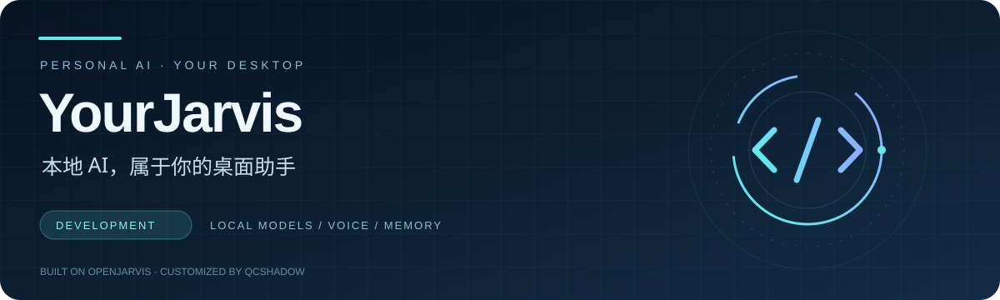

<div align="center">
  

  <h1>YourJarvis · 开发版</h1>
  <p><strong>中文优先的 Windows AI 桌面助手</strong></p>
  <p>本地模型 · 语音对话 · 持久记忆 · 朋友共享</p>
  <p>
    <a href="#功能一览">功能一览</a> ·
    <a href="#开始开发">开始开发</a> ·
    <a href="#文档导航">文档导航</a> ·
    <a href="https://github.com/QcShadow/YourJarvis-link/releases">下载朋友版</a> ·
    <a href="https://gitee.com/QcShadow/your-jarvis-link/releases">国内下载</a>
  </p>
</div>

---

**YourJarvis** 是 QcShadow 基于 [OpenJarvis](https://github.com/open-jarvis/OpenJarvis) 维护的个人定制分支，面向 Windows 桌面使用与朋友分享。这里维护源码、测试和构建流程；可直接安装的成品发布在 **YourJarvis Link**。

> **想直接使用？** 前往 [GitHub Releases](https://github.com/QcShadow/YourJarvis-link/releases) 或 [Gitee 发行版](https://gitee.com/QcShadow/your-jarvis-link/releases)，下载 `JARVIS-Setup-0.1.3.exe`，双击进入中文安装向导。

## 功能一览

| 能力 | 使用体验 |
| :--- | :--- |
| **桌面交互** | 中文优先的聊天界面、浅色／深色主题、角色配色和 Windows 托盘入口 |
| **模型连接** | 在本地 Ollama、兼容 API 和 JARVIS 共享主机之间选择 |
| **语音对话** | 本地中文／英文识别与播报，可选唤醒监听；按方案准备语音资源 |
| **持久记忆** | 角色、用户偏好与记忆独立于模型权重维护，便于更换模型 |
| **朋友共享** | 独立共享网关、邀请令牌、撤销、排队和速率限制 |
| **安装与更新** | 中文单 EXE 向导、Gitee 优先与 GitHub 回退、断点续传和 SHA-256 校验 |

本地模型和已安装的本地语音可离线运行。选择第三方 API 或共享主机时，推理由相应服务处理；首次准备依赖与模型需要联网。

## 选择合适的版本

| | 开发版 · 本仓库 | 朋友版 · YourJarvis Link |
| :--- | :--- | :--- |
| **适合谁** | 修改代码、调试模型、构建应用的开发者 | 希望直接安装使用的 Windows 用户 |
| **交付内容** | 源码、测试、文档、部署和打包脚本 | 安装 EXE、发行说明和更新清单 |
| **开始方式** | 克隆源码，配置开发环境 | 下载 EXE，按中文向导安装 |
| **入口** | [开始开发](#开始开发) | [GitHub 下载](https://github.com/QcShadow/YourJarvis-link/releases) · [Gitee 下载](https://gitee.com/QcShadow/your-jarvis-link/releases) |

## 开始开发

### 1. 准备环境

| 依赖 | 要求 |
| :--- | :--- |
| Python | `3.10–3.13`，以 `pyproject.toml` 为准 |
| uv | Python 依赖与虚拟环境管理 |
| Node.js / npm | 前端开发需要 Node.js `22.22+`、npm `11.19.x` |
| 推理服务 | 本地 Ollama，或自行配置的兼容 API |

### 2. 获取源码与依赖

```powershell
git clone https://github.com/QcShadow/YourJarvis-dev.git
cd YourJarvis-dev
uv sync --extra dev --extra desktop
```

配置模型与使用命令行：

```powershell
uv run jarvis init
uv run jarvis doctor
uv run jarvis ask "你好，请用一句话介绍自己。"
```

### 3. 构建并启动界面

在源码根目录执行：

```powershell
cd frontend
npm ci
npm run build
cd ..
uv run jarvis gui
```

`jarvis gui` 启动本地后端和浏览器界面。原生 Windows 启动器及朋友版安装 EXE 的构建流程见 [发布说明](docs/yourjarvis-release.md)；需要语音或其他后端时，按对应文档准备额外依赖和模型。

### 4. 验证改动

```powershell
uv run pytest tests/ -v
```

前端改动可在 `frontend` 目录运行 `npm test` 与 `npm run build`。需要真实推理服务或特定硬件的测试，请按 [开发指南](docs/development/contributing.md) 配置环境。

## 文档导航

| 想了解什么 | 从这里开始 |
| :--- | :--- |
| 基本使用与配置 | [快速开始](docs/getting-started/quickstart.md) · [配置说明](docs/getting-started/configuration.md) |
| Windows 环境 | [原生 Windows 指南](docs/getting-started/windows-native.md) |
| 系统如何工作 | [架构概览](docs/architecture/overview.md) · [模型引擎](docs/architecture/engine.md) · [记忆](docs/architecture/memory.md) |
| 修改与测试源码 | [开发指南](docs/development/contributing.md) · [贡献说明](CONTRIBUTING.md) |
| 打包与发布朋友版 | [YourJarvis 发布流程](docs/yourjarvis-release.md) · [0.1.3 安装器说明](docs/installer-0.1.3.md) |
| 上游框架与研究 | [OpenJarvis 仓库](https://github.com/open-jarvis/OpenJarvis) · [项目文档](https://open-jarvis.github.io/OpenJarvis/) |

## 仓库结构

```text
src/openjarvis/        Python 后端、模型引擎、语音、记忆与工具
frontend/             React + TypeScript 桌面聊天界面
deploy/yourjarvis/     Windows 启动器、安装器与发布配置
deploy/share/          应用与运行资源打包
tests/                Python 测试
docs/                 使用、架构、开发与发布文档
```

## 发布约定

从干净的 Git 快照构建朋友版，按需发布运行库和模型资源。发布包不包含制作者的密钥、私人配置、聊天、记忆或浏览器数据；完整构建与安装验证要求见 [发布流程](docs/yourjarvis-release.md)。

朋友版目前采用 **0.1.3 单 EXE 安装流程**。升级时退出应用，运行新版安装器并选择原安装目录，保留已有配置、聊天、记忆和模型。

## 致谢与许可

YourJarvis 保留 OpenJarvis 的基础框架、部分文档与测试，遵循 [Apache License 2.0](LICENSE)。它是个人定制分支，不代表 OpenJarvis 官方项目或官方发布。

OpenJarvis 由 Stanford 的 Hazy Research、Scaling Intelligence Lab 等原作者维护。请访问 [官方仓库](https://github.com/open-jarvis/OpenJarvis)、[官方项目网站](https://openjarvis.stanford.edu/) 和 [论文](https://arxiv.org/abs/2605.17172) 了解上游成果。随包分发的第三方组件保留各自许可证和声明。

<details>
<summary>引用上游 OpenJarvis 论文</summary>

```bibtex
@misc{saadfalcon2026openjarvispersonalaipersonal,
  title={OpenJarvis: Personal AI, On Personal Devices},
  author={Jon Saad-Falcon and Avanika Narayan and Robby Manihani and Tanvir Bhathal and Herumb Shandilya and Hakki Orhun Akengin and Gabriel Bo and Andrew Park and Matthew Hart and Caia Costello and Chuan Li and Christopher Ré and Azalia Mirhoseini},
  year={2026},
  eprint={2605.17172},
  archivePrefix={arXiv},
  primaryClass={cs.LG},
  url={https://arxiv.org/abs/2605.17172}
}
```

</details>
